# Чтение данных


``` r
data <- readRDS("data/raw/very_low_birthweight.RDS") 
```

``` r
# Добавление id 

data <- data %>%
  mutate(id = row_number())

# Перевод категориальных переменных в факторы

data <- data %>% mutate(
  across(c(id, race, inout, delivery, pvh, ivh, ipe, sex), ~ as.factor(.x))) 
```

# Удаление колонок с более 100 пропусков и строк с пропусками


``` r
cleaned_data <- data %>% select(where(~ sum(is.na(.)) <= 100)) %>% 
  filter(across(everything(), ~ !is.na(.)))
```

```
## Warning: Using `across()` in `filter()` was deprecated in dplyr 1.0.8.
## ℹ Please use `if_any()` or `if_all()` instead.
## Call `lifecycle::last_lifecycle_warnings()` to see where this warning was
## generated.
```

# Удаление выбросов 


``` r
outliers <- function(x) {
  (x < quantile(x, 0.25) - 3*IQR(x)) | 
    (x > quantile(x, 0.75) + 3*IQR(x))
}

cleaned_data %>% filter(across(where(is.numeric), ~ !outliers(.))) %>% glimpse()
```

```
## Warning: Using `across()` in `filter()` was deprecated in dplyr 1.0.8.
## ℹ Please use `if_any()` or `if_all()` instead.
## Call `lifecycle::last_lifecycle_warnings()` to see where this warning was
## generated.
```

```
## Rows: 277
## Columns: 20
## $ birth    <dbl> 81.514, 81.558, 81.610, 81.624, 81.626, 81.689, 81.697, 81.70…
## $ exit     <dbl> 81.539, 81.667, 81.697, 81.700, 81.730, 81.878, 81.952, 81.82…
## $ hospstay <int> 9, 40, 32, 28, 38, 69, 93, 44, 44, 70, 85, 58, 75, 35, 34, 46…
## $ lowph    <dbl> 7.250000, 7.250000, 7.320000, 7.160000, 7.039997, 7.419998, 7…
## $ pltct    <int> 244, 182, 282, 153, 229, 361, 255, 186, 134, 229, 68, 174, 17…
## $ race     <fct> white, black, black, black, white, white, black, white, white…
## $ bwt      <int> 1370, 1480, 1255, 1350, 1310, 1180, 770, 1490, 1000, 1120, 74…
## $ gest     <dbl> 32.0, 32.0, 29.5, 34.0, 32.0, 28.0, 26.0, 33.0, 28.0, 29.0, 2…
## $ inout    <fct> born at Duke, born at Duke, born at Duke, born at Duke, born …
## $ twn      <int> 0, 0, 0, 0, 0, 0, 0, 0, 0, 0, 0, 0, 0, 0, 0, 0, 0, 0, 0, 0, 0…
## $ delivery <fct> abdominal, vaginal, vaginal, abdominal, vaginal, abdominal, v…
## $ apg1     <int> 7, 8, 9, 4, 6, 6, 4, 8, 5, 9, 9, 9, 1, 8, 4, 6, 9, 6, 8, 9, 8…
## $ vent     <int> 0, 0, 0, 0, 1, 0, 1, 0, 0, 1, 0, 0, 1, 0, 0, 0, 0, 0, 0, 0, 1…
## $ pneumo   <int> 0, 0, 0, 0, 0, 0, 0, 0, 0, 0, 0, 0, 0, 0, 0, 0, 0, 0, 0, 0, 0…
## $ pda      <int> 0, 0, 0, 0, 0, 0, 0, 0, 0, 0, 0, 0, 0, 0, 0, 0, 0, 0, 0, 0, 0…
## $ cld      <int> 0, 0, 0, 0, 0, 0, 1, 0, 0, 0, 0, 0, 1, 0, 0, 0, 0, 0, 0, 0, 0…
## $ year     <dbl> 81.51471, 81.55847, 81.61053, 81.62421, 81.62695, 81.68988, 8…
## $ sex      <fct> female, male, female, female, male, male, male, male, female,…
## $ dead     <int> 0, 0, 0, 0, 0, 0, 0, 0, 0, 0, 0, 0, 0, 0, 0, 0, 0, 0, 0, 0, 0…
## $ id       <fct> 2, 4, 7, 10, 11, 14, 16, 17, 21, 22, 23, 25, 31, 35, 36, 41, …
```

# Создание графиков плотности для числовых переменных


``` r
data_long <- cleaned_data %>%
  select(where(is.numeric)) %>%
  pivot_longer(everything(), names_to = "variable", values_to = "value")

ggplot(data_long, aes(x = value)) +
  geom_density(fill = "blue") +
  facet_wrap(~ variable, scales = "free")+
  theme_bw()
```

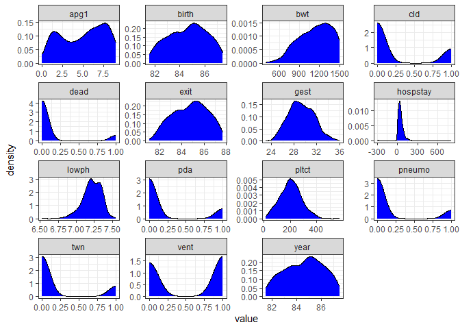<!-- -->
# Графики плотности для переменных bwt и gest с окраской по inout


``` r
data_long <- cleaned_data %>%
  pivot_longer(cols = c(bwt, gest), names_to = "variable", values_to = "value")

ggplot(data_long, aes(x = value, fill = inout)) +
  geom_density(alpha = 0.5) +
  facet_wrap(~ variable, scales = "free", nrow=2)+
  theme_bw()
```

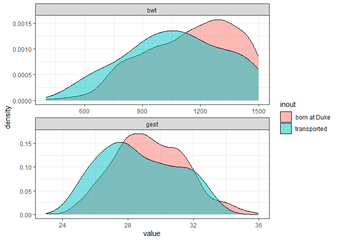<!-- -->
# Cравнение значений колонки ‘lowph’ между группами в переменной inout

H0: среднее lowph в группе born at Duke равно среднему в группе transported

H1: средние не равны

Большие выборки, распределение приближается к нормальному по ЦПТ, используем двусторонний t тест c поправкой Уэлча для неизвестных дисперсий (уровень значимости установим 0.05)

t = 5.5731, df = 111.03, p-value = 1.77e-07 

p-value<0.05

95 percent confidence interval:
 0.05762847 0.1212193
 
 0 не входит в ДИ
 
 Следовательно, отклоняем нулевую гипотезу в пользу альтернативной
 
 Как бы вы интерпретировали результат, если бы знали, что более низкое значение lowph ассоциировано с более низкой выживаемостью?
 
 В таком случае группа transported имеет более низкую выживаемость по сравнению с группой born at Duke


``` r
test <- cleaned_data %>% t_test(lowph ~ inout, detailed=TRUE) %>% 
  add_significance()
```

```
## Warning: The statistic is based on a difference or ratio; by default, for
## difference-based statistics, the explanatory variable is subtracted in the
## order "born at Duke" - "transported", or divided in the order "born at Duke" /
## "transported" for ratio-based statistics. To specify this order yourself,
## supply `order = c("born at Duke", "transported")`.
```

``` r
print(test)
```

```
## # A tibble: 1 × 7
##   statistic  t_df     p_value alternative estimate lower_ci upper_ci
##       <dbl> <dbl>       <dbl> <chr>          <dbl>    <dbl>    <dbl>
## 1      5.57  111. 0.000000177 two.sided     0.0894   0.0576    0.121
```

``` r
  ggplot(cleaned_data, aes(x=inout, y=lowph, fill=inout))+
  geom_boxplot()+
  #stat_pvalue_manual(test, label="p-value")+ не работает с этой строкой, в чем причина?
  theme_bw()
```

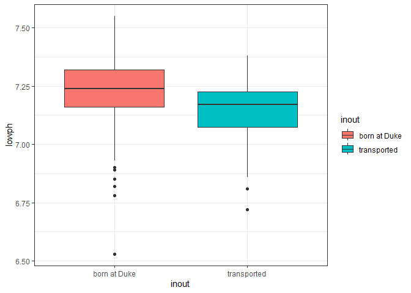<!-- -->

# Корреляционный анализ


``` r
num_data <- cleaned_data %>% select(where(is.numeric), -c(birth,year, exit)) %>% glimpse()
```

```
## Rows: 531
## Columns: 12
## $ hospstay <int> 9, 40, 2, 32, 28, 38, 62, 69, 1, 93, 44, 66, 65, 44, 70, 85, …
## $ lowph    <dbl> 7.250000, 7.250000, 6.969997, 7.320000, 7.160000, 7.039997, 7…
## $ pltct    <int> 244, 182, 54, 282, 153, 229, 182, 361, 378, 255, 186, 260, 18…
## $ bwt      <int> 1370, 1480, 925, 1255, 1350, 1310, 1110, 1180, 970, 770, 1490…
## $ gest     <dbl> 32.0, 32.0, 28.0, 29.5, 34.0, 32.0, 28.0, 28.0, 28.0, 26.0, 3…
## $ twn      <int> 0, 0, 0, 0, 0, 0, 0, 0, 0, 0, 0, 1, 0, 0, 0, 0, 0, 1, 0, 0, 1…
## $ apg1     <int> 7, 8, 5, 9, 4, 6, 6, 6, 2, 4, 8, 1, 8, 5, 9, 9, 9, 6, 2, 1, 6…
## $ vent     <int> 0, 0, 1, 0, 0, 1, 0, 0, 1, 1, 0, 1, 1, 0, 1, 0, 0, 1, 0, 1, 0…
## $ pneumo   <int> 0, 0, 1, 0, 0, 0, 1, 0, 1, 0, 0, 1, 1, 0, 0, 0, 0, 1, 0, 1, 0…
## $ pda      <int> 0, 0, 0, 0, 0, 0, 0, 0, 0, 0, 0, 0, 0, 0, 0, 0, 0, 0, 0, 0, 0…
## $ cld      <int> 0, 0, 0, 0, 0, 0, 1, 0, 0, 1, 0, 0, 1, 0, 0, 0, 0, 0, 1, 0, 0…
## $ dead     <int> 0, 0, 1, 0, 0, 0, 0, 0, 1, 0, 0, 0, 0, 0, 0, 0, 0, 1, 0, 0, 0…
```


``` r
data_cor <- cor(num_data)

data_cor %>% corr.test(method = "spearman") %>% 
  print(short=FALSE)
```

```
## Call:corr.test(x = ., method = "spearman")
## Correlation matrix 
##          hospstay lowph pltct   bwt  gest   twn  apg1  vent pneumo   pda   cld
## hospstay     1.00 -0.76 -0.71 -0.87 -0.83 -0.61 -0.76  0.84   0.64  0.83  0.95
## lowph       -0.76  1.00  0.83  0.85  0.90  0.60  0.84 -0.97  -0.94 -0.85 -0.85
## pltct       -0.71  0.83  1.00  0.78  0.75  0.41  0.91 -0.85  -0.83 -0.82 -0.80
## bwt         -0.87  0.85  0.78  1.00  0.97  0.80  0.92 -0.90  -0.74 -0.92 -0.95
## gest        -0.83  0.90  0.75  0.97  1.00  0.83  0.87 -0.94  -0.80 -0.94 -0.94
## twn         -0.61  0.60  0.41  0.80  0.83  1.00  0.65 -0.64  -0.39 -0.65 -0.71
## apg1        -0.76  0.84  0.91  0.92  0.87  0.65  1.00 -0.86  -0.76 -0.83 -0.86
## vent         0.84 -0.97 -0.85 -0.90 -0.94 -0.64 -0.86  1.00   0.88  0.91  0.93
## pneumo       0.64 -0.94 -0.83 -0.74 -0.80 -0.39 -0.76  0.88   1.00  0.83  0.73
## pda          0.83 -0.85 -0.82 -0.92 -0.94 -0.65 -0.83  0.91   0.83  1.00  0.94
## cld          0.95 -0.85 -0.80 -0.95 -0.94 -0.71 -0.86  0.93   0.73  0.94  1.00
## dead         0.69 -0.97 -0.79 -0.82 -0.87 -0.55 -0.80  0.90   0.97  0.85  0.78
##           dead
## hospstay  0.69
## lowph    -0.97
## pltct    -0.79
## bwt      -0.82
## gest     -0.87
## twn      -0.55
## apg1     -0.80
## vent      0.90
## pneumo    0.97
## pda       0.85
## cld       0.78
## dead      1.00
## Sample Size 
## [1] 12
## Probability values (Entries above the diagonal are adjusted for multiple tests.) 
##          hospstay lowph pltct  bwt gest  twn apg1 vent pneumo  pda  cld dead
## hospstay     0.00  0.07  0.11 0.01 0.03 0.20 0.08 0.02   0.20 0.03 0.00 0.13
## lowph        0.00  0.00  0.03 0.02 0.00 0.20 0.02 0.00   0.00 0.02 0.02 0.00
## pltct        0.01  0.00  0.00 0.06 0.08 0.37 0.00 0.02   0.03 0.03 0.05 0.05
## bwt          0.00  0.00  0.00 0.00 0.00 0.05 0.00 0.00   0.08 0.00 0.00 0.03
## gest         0.00  0.00  0.01 0.00 0.00 0.03 0.01 0.00   0.05 0.00 0.00 0.01
## twn          0.04  0.04  0.18 0.00 0.00 0.00 0.20 0.20   0.37 0.20 0.11 0.20
## apg1         0.00  0.00  0.00 0.00 0.00 0.02 0.00 0.01   0.08 0.03 0.01 0.05
## vent         0.00  0.00  0.00 0.00 0.00 0.02 0.00 0.00   0.01 0.00 0.00 0.00
## pneumo       0.03  0.00  0.00 0.01 0.00 0.21 0.00 0.00   0.00 0.03 0.10 0.00
## pda          0.00  0.00  0.00 0.00 0.00 0.02 0.00 0.00   0.00 0.00 0.00 0.02
## cld          0.00  0.00  0.00 0.00 0.00 0.01 0.00 0.00   0.01 0.00 0.00 0.06
## dead         0.01  0.00  0.00 0.00 0.00 0.06 0.00 0.00   0.00 0.00 0.00 0.00
## 
##  Confidence intervals based upon normal theory.  To get bootstrapped values, try cor.ci
##             raw.lower raw.r raw.upper raw.p lower.adj upper.adj
## hspst-lowph     -0.93 -0.76     -0.33  0.00     -0.96      0.00
## hspst-pltct     -0.91 -0.71     -0.22  0.01     -0.95      0.07
## hspst-bwt       -0.96 -0.87     -0.58  0.00     -0.98     -0.23
## hspst-gest      -0.95 -0.83     -0.48  0.00     -0.98     -0.13
## hspst-twn       -0.88 -0.61     -0.05  0.04     -0.92      0.15
## hspst-apg1      -0.93 -0.76     -0.32  0.00     -0.96      0.00
## hspst-vent       0.51  0.84      0.95  0.00      0.15      0.98
## hspst-pneum      0.10  0.64      0.89  0.03     -0.13      0.93
## hspst-pda        0.49  0.83      0.95  0.00      0.14      0.98
## hspst-cld        0.83  0.95      0.99  0.00      0.62      0.99
## hspst-dead       0.20  0.69      0.91  0.01     -0.08      0.95
## lowph-pltct      0.49  0.83      0.95  0.00      0.14      0.98
## lowph-bwt        0.55  0.85      0.96  0.00      0.19      0.98
## lowph-gest       0.68  0.90      0.97  0.00      0.37      0.99
## lowph-twn        0.04  0.60      0.87  0.04     -0.14      0.91
## lowph-apg1       0.51  0.84      0.95  0.00      0.15      0.98
## lowph-vent      -0.99 -0.97     -0.88  0.00     -1.00     -0.71
## lowph-pneum     -0.98 -0.94     -0.81  0.00     -0.99     -0.58
## lowph-pda       -0.96 -0.85     -0.55  0.00     -0.98     -0.19
## lowph-cld       -0.96 -0.85     -0.53  0.00     -0.98     -0.17
## lowph-dead      -0.99 -0.97     -0.88  0.00     -1.00     -0.71
## pltct-bwt        0.36  0.78      0.93  0.00      0.03      0.97
## pltct-gest       0.31  0.75      0.92  0.01     -0.01      0.96
## pltct-twn       -0.21  0.41      0.80  0.18     -0.30      0.83
## pltct-apg1       0.70  0.91      0.97  0.00      0.40      0.99
## pltct-vent      -0.96 -0.85     -0.55  0.00     -0.98     -0.19
## pltct-pneum     -0.95 -0.83     -0.48  0.00     -0.98     -0.13
## pltct-pda       -0.95 -0.82     -0.46  0.00     -0.98     -0.12
## pltct-cld       -0.94 -0.80     -0.41  0.00     -0.97     -0.07
## pltct-dead      -0.94 -0.79     -0.40  0.00     -0.97     -0.06
## bwt-gest         0.90  0.97      0.99  0.00      0.76      1.00
## bwt-twn          0.41  0.80      0.94  0.00      0.07      0.97
## bwt-apg1         0.74  0.92      0.98  0.00      0.47      0.99
## bwt-vent        -0.97 -0.90     -0.66  0.00     -0.99     -0.34
## bwt-pneum       -0.92 -0.74     -0.29  0.01     -0.96      0.02
## bwt-pda         -0.98 -0.92     -0.74  0.00     -0.99     -0.47
## bwt-cld         -0.99 -0.95     -0.83  0.00     -0.99     -0.62
## bwt-dead        -0.95 -0.82     -0.46  0.00     -0.98     -0.11
## gest-twn         0.48  0.83      0.95  0.00      0.12      0.98
## gest-apg1        0.58  0.87      0.96  0.00      0.23      0.98
## gest-vent       -0.98 -0.94     -0.79  0.00     -0.99     -0.54
## gest-pneum      -0.94 -0.80     -0.41  0.00     -0.97     -0.06
## gest-pda        -0.98 -0.94     -0.79  0.00     -0.99     -0.54
## gest-cld        -0.98 -0.94     -0.79  0.00     -0.99     -0.54
## gest-dead       -0.96 -0.87     -0.58  0.00     -0.98     -0.23
## twn-apg1         0.12  0.65      0.89  0.02     -0.13      0.93
## twn-vent        -0.89 -0.64     -0.11  0.02     -0.93      0.13
## twn-pneum       -0.79 -0.39      0.24  0.21     -0.79      0.24
## twn-pda         -0.89 -0.65     -0.12  0.02     -0.94      0.15
## twn-cld         -0.91 -0.71     -0.24  0.01     -0.95      0.06
## twn-dead        -0.86 -0.55      0.03  0.06     -0.89      0.17
## apg1-vent       -0.96 -0.86     -0.57  0.00     -0.98     -0.21
## apg1-pneum      -0.93 -0.76     -0.32  0.00     -0.96      0.01
## apg1-pda        -0.95 -0.83     -0.49  0.00     -0.98     -0.13
## apg1-cld        -0.96 -0.86     -0.57  0.00     -0.98     -0.21
## apg1-dead       -0.94 -0.80     -0.41  0.00     -0.97     -0.06
## vent-pneum       0.62  0.88      0.97  0.00      0.28      0.99
## vent-pda         0.70  0.91      0.97  0.00      0.40      0.99
## vent-cld         0.76  0.93      0.98  0.00      0.50      0.99
## vent-dead        0.66  0.90      0.97  0.00      0.34      0.99
## pneum-pda        0.48  0.83      0.95  0.00      0.12      0.98
## pneum-cld        0.26  0.73      0.92  0.01     -0.04      0.96
## pneum-dead       0.88  0.97      0.99  0.00      0.71      1.00
## pda-cld          0.79  0.94      0.98  0.00      0.54      0.99
## pda-dead         0.53  0.85      0.96  0.00      0.17      0.98
## cld-dead         0.36  0.78      0.93  0.00      0.03      0.97
```

``` r
corrplot(data_cor, method = 'number',insig = "blank")
```

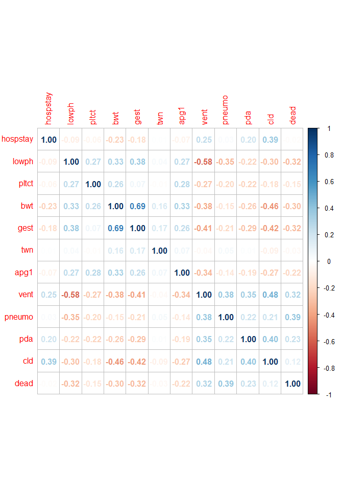<!-- -->

``` r
data_cor %>%
  network_plot(min_cor = .0)
```

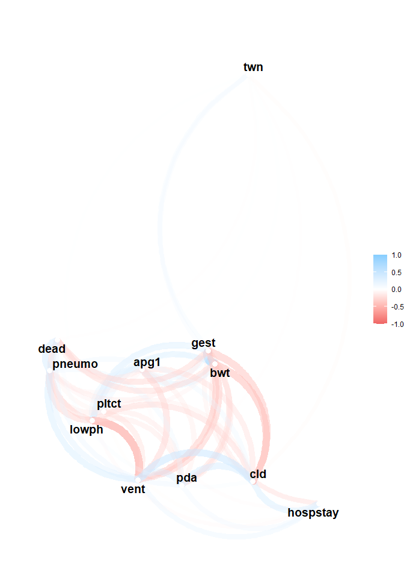<!-- -->
# Иерархическая кластеризация


``` r
# Стандартизация
data_scaled <- scale(data_cor)
# Матрица дистанций
data_dist <- dist(data_scaled, method = "euclidean")
# Дендрограмма кластеров
data_dist.hc <- hclust(d = data_dist, method = "ward.D2")
# Визуализация
fviz_dend(data_dist.hc, 
          k=2, 
          cex = 0.6,
          color_labels_by_k = TRUE,
          rect = TRUE) 
```

```
## Warning: The `<scale>` argument of `guides()` cannot be `FALSE`. Use "none" instead as
## of ggplot2 3.3.4.
## ℹ The deprecated feature was likely used in the factoextra package.
##   Please report the issue at <https://github.com/kassambara/factoextra/issues>.
## This warning is displayed once every 8 hours.
## Call `lifecycle::last_lifecycle_warnings()` to see where this warning was
## generated.
```

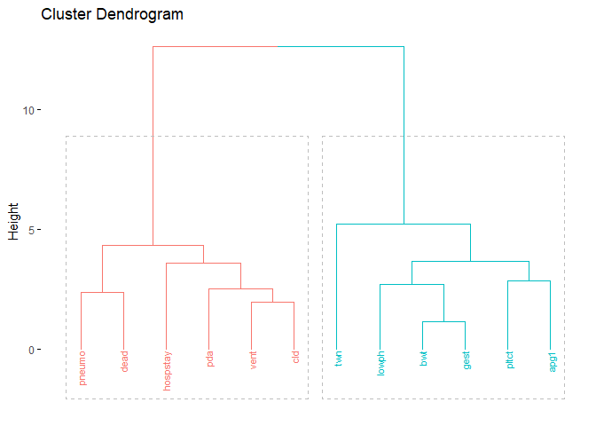<!-- -->

``` r
# Определение оптимального количества кластеров методом силуэт и потом оптимизация кода выше
fviz_nbclust(data_scaled, kmeans, method = "silhouette")
```

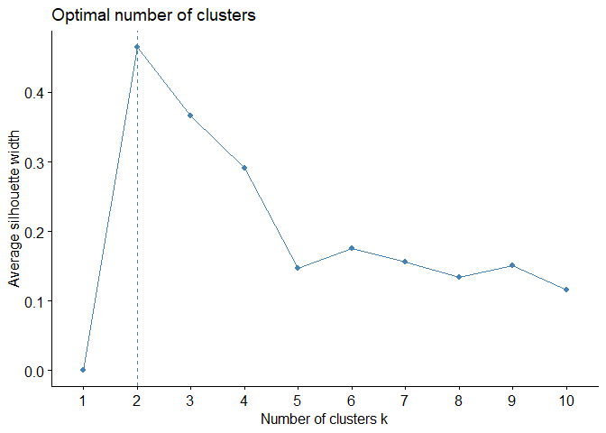<!-- -->
# Heatmap+кластеризация

Вывод: в данных имеется два кластера: 1(pneumo, dead, hospstay, pda, vent, cld) и 2 (lowph, bwt, gest, pltct, apg1, twn). Между кластерами наблюдается преимущественно отрицательная корреляция.


``` r
pheatmap(data_scaled, 
         show_rownames = TRUE, 
         clustering_distance_rows = data_dist,
         clustering_method = "ward.D2", 
         cutree_rows = 5,
         cutree_cols = length(colnames(data_scaled)),
         angle_col = 45, 
         main = "Dendrograms for clustering rows and columns with heatmap")
```

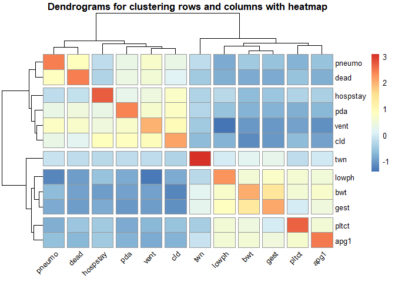<!-- -->
# PCA

Вывод: первая компонента описывает 65% вариаций, а первые две компоненты описывают 75.45% вариаций данных (следовательно, в этих данных много скоррелированных между собой переменных). 1 группа (pneumo, dead, hospstay, pda, vent, cld) и 2 (lowph, bwt, gest, pltct, apg1, twn) имеют отрицательную корреляцию между группами, но при этом они скоррелированы между собой внутри групп.


``` r
# Используем стандартизованные значения для PCA, так как шкалы у переменных разные

data_pca <- prcomp(num_data, scale = T) 
summary(data_pca)
```

```
## Importance of components:
##                           PC1    PC2     PC3     PC4     PC5     PC6     PC7
## Standard deviation     1.9667 1.1625 1.07954 0.99768 0.90725 0.88700 0.83410
## Proportion of Variance 0.3223 0.1126 0.09712 0.08295 0.06859 0.06556 0.05798
## Cumulative Proportion  0.3223 0.4350 0.53208 0.61503 0.68362 0.74918 0.80716
##                            PC8     PC9    PC10    PC11    PC12
## Standard deviation     0.81596 0.76417 0.66649 0.60125 0.50858
## Proportion of Variance 0.05548 0.04866 0.03702 0.03013 0.02155
## Cumulative Proportion  0.86264 0.91130 0.94832 0.97845 1.00000
```

``` r
fviz_pca_var(data_pca, col.var = "contrib")
```

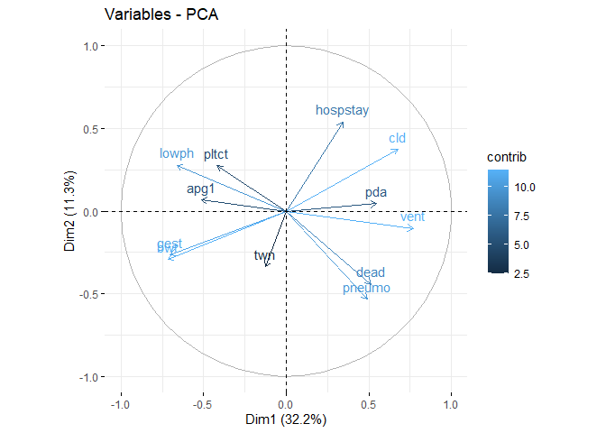<!-- -->
# biplots


``` r
biplot <- ggbiplot(data_pca,
         groups = as.factor(cleaned_data$dead),
         scale=0, alpha = 0.5) + 
  theme_bw()
biplot
```

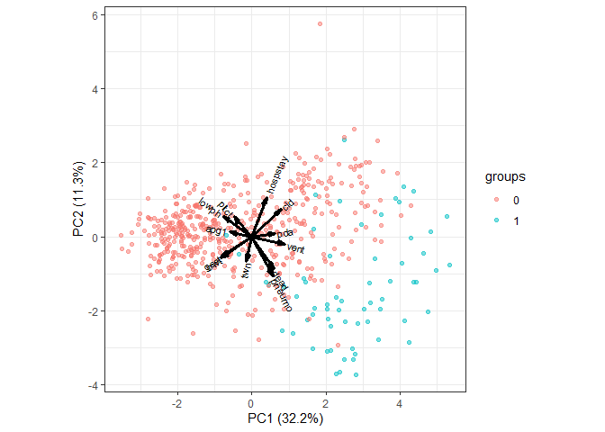<!-- -->


``` r
data_pca$id <-cleaned_data$id

ggplotly(biplot) %>%
  style(text = paste("ID:", data_pca$id)) # как сделать без перекрытия переменных?
```

```{=html}
<div class="plotly html-widget html-fill-item" id="htmlwidget-ae593bde0f735d05eac7" style="width:672px;height:480px;"></div>
<script type="application/json" data-for="htmlwidget-ae593bde0f735d05eac7">{"x":{"data":[{"x":[-2.234964069163937,-2.2518632323344163,-2.0650055327641756,-1.7162077127425739,-0.61608899529715344,0.82615078154049726,-1.7722565733316482,1.731137612273002,-2.126014165781636,0.098922646462563768,0.87517288038041763,-0.54591339020095031,-0.27532516822663405,0.3180194092329432,-1.519832397049754,-0.14298364413081213,0.20572105796229417,-1.4698901471355887,1.361303188234803,-0.69283985525542424,-2.3391609453383877,-1.3105691039203309,-0.48543057606287626,-1.9796176535727381,1.6071286890317438,0.55516134846621301,-1.4136033626622133,-0.76588832970078946,-1.8934824471897831,-1.3822468577276905,-0.37270415339253166,-1.9376334045292556,0.73841278182209635,2.0343394908576018,1.4375769496260444,-1.3625286791331925,0.6502916120452702,-1.3419892204583863,-2.237453219616051,-0.24678884975258084,-0.072350647350918673,3.0488531536194912,-2.2269976285215258,-1.789899904335043,-1.8942122942024333,0.84776122635091644,-0.40221959966914805,0.15520228478171566,-1.3940666171526714,-1.3877273483678423,-0.7537525369168171,-1.8942898539424986,-0.18415018372301004,-0.57862471372287594,-0.96835038715314958,-0.73579949353194063,2.4119623953224858,-2.1179839906163331,0.73767788171528792,1.338978505077179,0.24890893630557981,-0.73045208467097966,-0.63986572120182028,1.6737514663220401,-0.918203620995797,4.0395289671883745,-1.9400013012480202,-2.4691680920727492,-1.4854546189840014,-0.88633739294978486,-0.57643366539831487,-0.29841766473013853,0.66032136455326329,-1.6544152097264821,-2.2693504543406577,2.1849631648935004,-1.6932084985273725,-0.012128725011369947,-0.65137354578193718,-1.9596361670129603,-2.5176770381915441,-2.0722191184798282,0.5006736135349763,1.3168113856178154,-1.5532938781965291,-2.0389655151642203,3.3336215782803809,2.226181247491045,1.8992595693320917,-0.57851523370901858,1.5115390113273184,-2.4462936472787109,-2.1381227207084161,-0.11182715159623427,2.9074877582526075,-0.043733777512831064,1.1910339615999463,-1.6959021968883305,-1.8689137710005213,1.0170027259963847,-1.9164790796060669,-1.5557525042391451,0.16954084500863723,1.4133255832114884,-1.0662441875025135,1.3490857979939359,-2.0843373500093763,-0.14962890685029348,-1.1142300878657057,0.058803038329451565,-2.3336176231964831,1.5577745948160917,-1.2323701939075533,-1.8977648719330491,0.54216250810779854,-2.0455488283710586,3.0814551921356799,3.5017933905670606,-1.0137605607988611,-1.5337704485120012,-0.69406477002725042,-1.1396778301265174,-1.715848121590887,2.9572427933434535,-1.82604942632334,0.49548222404986419,-0.75146912292071832,-1.1350262891210008,0.64078639484512157,0.59333721451923394,1.114021076819637,-2.4519995401580221,1.1883283273773084,-1.5380572649203372,3.1338064060913373,1.5454168122158412,-0.96496612683855698,-2.3795651564807168,1.6649248309710909,-1.6047160036581181,-1.0344675266214207,1.955207174091415,-1.8264654756929375,-1.8961139120832171,3.4796552122520321,-2.4539567823872908,2.7591096862696518,-2.0654259830847344,0.30007037140476206,-0.61002075488193863,1.0875360923601063,-1.1395971270629892,1.4191345112800784,1.695315345717666,-2.6409064667587354,-2.3799869719408835,-2.3619640959667914,0.17640909747291605,-0.3149554809920882,1.2821801218864002,1.4667748718343623,0.90556941588294604,-1.3253946824270495,-1.7261043091010817,-2.2427750393114683,0.50902373955745961,2.7894370710503473,-1.7038743727190808,0.5090158777172763,2.6962893461970929,-2.3111628236993842,-1.1529210080437293,-0.51366079165536616,-1.4400512951015934,-3.0598907641968158,1.8878544167493414,-2.0804257503216781,-2.2588500705942143,-1.8742626815993091,1.0246061931238721,-2.7966053189750419,-2.4094018343163435,-3.0214242036358261,-0.36047107654160448,1.3680103860453363,-1.6486172222838544,1.3465560428437859,0.053739910615534396,0.66857791359912666,-2.4416972630492202,0.83673738393559727,3.3122582560343448,-2.0006702082266967,-2.3355600333915456,0.8705640243959698,-0.12108455912331312,-2.0947341061246685,1.8370663512809311,-3.2368974016120498,-0.85047265498661295,-2.049012354425698,1.5028858840285066,-1.9565073550484171,-1.6155522081525582,2.7755042341047478,1.2433433273908692,0.43753458428790382,-1.8117998279960155,-2.5556217315417071,-0.90785101952995018,-2.7918603882119464,1.4124798612397593,-0.94998076730703596,-1.6495423110048253,-1.8394472560335651,-0.97721950443431937,1.3894709326840478,-0.30080166523651397,-2.1303419170877298,-0.57016230594118089,-2.2896215255891521,-3.5397612515032808,-2.0018588278905334,0.38037886811401483,-2.7610639878745906,0.26627500669034515,-0.57081177240746339,-1.7300224683841741,0.66500989649534992,1.2080906425561724,0.60895493103548304,-0.49983849479435721,-1.1285141337367308,-2.6240750097827212,-0.49365401748074961,-1.6022058880285375,3.006401010689471,2.3387006741645857,-1.6002013914241691,-2.5390156903311012,-2.1246535345335626,-2.47968276035669,-0.17259230012863466,-1.5815621923031429,0.33176611655780697,2.356882909029157,1.1107593241845339,0.52155813414122065,-2.1414536007798834,-0.98822832995817655,0.74804210720517084,-1.1881641985454034,-2.7245859498881631,-2.8186089768807667,-1.7023996530580721,0.39537644925378357,4.2986318424499252,-1.2670906509125686,-0.74702141526034538,2.8022648174353644,2.1076496080268381,0.41014087552065182,-0.22026110894464634,2.1545984040060051,-2.5307482102382108,-1.4943234499962179,-0.3111995390573587,2.1880077552963417,0.7036235122554193,-1.8321081940285726,-1.4968907184109441,1.0165040348951195,-0.14736327264668034,-2.0235365319779208,-2.566541401622052,1.4133498501619044,1.8175742038409506,-1.0557378159567756,-0.24676459178099952,-1.2615585140063179,1.1657480055516278,-1.6035730784097719,3.9221409110097194,0.075237420231143187,2.6155916032817599,3.1004562071831261,-0.52358954889709941,0.01366461663358734,-0.61559589636623147,3.1764736193842151,-2.0896734393538856,-1.8949015122891117,-1.671573190656356,-0.48889701503152799,-1.6652590472891478,1.2876321644919417,-1.9480836954990108,-2.7954274718540253,0.19377514429517032,0.25333191678401795,-2.513594863606587,-0.45800002744929386,-2.2226948031648073,1.6380775916438994,0.039600477464237484,-2.0202677888649436,1.1847710491280661,-2.3126578804249736,1.2899682826367276,1.9864802300787792,-0.52271588562480753,1.0661241923359006,-1.5289664685161428,-0.79105118146485165,-1.646620174791452,-2.3790764582928854,1.5055102540551015,-1.2877809591174887,1.2663692940092577,-3.0739625984791905,1.0931256173313013,-2.1255901721337302,-2.6285723648948878,-1.7485855037643632,2.1432780014426092,2.2845449445639927,0.95339202038682658,-1.7386544023037436,-1.6145330231340593,-1.1174509272480988,-1.6040818873047975,-1.8855734655866059,-0.11840319193778603,-1.241799793907105,0.82438791001247713,-0.46428585451893001,-1.9825572430527199,-2.6309057652342132,-0.88373856610625789,-2.7374622766412977,-2.4475435839146469,-0.74476385746860696,-1.5705493753140058,1.8559420741023247,2.3371571097160624,2.4394652874254583,-0.87743416625837012,1.3743037045066255,-1.4009844736861734,-1.9378718344945243,-2.6466167011769697,0.67793338502766132,-1.6560335173547791,2.8108795566240325,-1.4982767866702562,-0.70609428892285031,1.2956908287023294,1.2217345815557001,2.1004402494724914,2.6771909442582928,1.9484789745824891,-1.9699784805067484,2.9128256997692299,2.781652719135856,2.9703695813755009,-1.2694753315064102,0.77606835778970273,0.18667395232679637,-1.5046903532626175,0.85193251145641902,-2.7408464468821836,-1.0547738583382711,-1.9434386206401235,-1.5758539637972868,-1.0515171167186401,2.0808286719502513,1.5537381058545119,-0.63365300169769967,-2.2197659547434969,2.0251108833508908,-3.5102339239401412,-3.2504838271119914,-0.11730683318170648,-1.3318597060668147,1.6858296166704887,-1.7844975382513573,-2.5028213261008099,-1.4701603468606137,-1.4803859532416697,0.38923303554109956,-2.1815268672069741,0.14322255188503924,3.09237753594764,-1.0432046115745532,-2.4080891644409608,-2.2822728896557467,-2.1507727544726047,2.5057169800382479,-0.56965877303677781,0.28506862146132983,-1.9049999250822811,-2.2997667829192689,1.4767285807625652,3.5520071553948345,1.7060810649844396,-2.1305208466873333,-0.26645185223164353,-2.0789574320883992,-2.89772388147381,-1.5098217268698038,1.1614808100685401,2.3157333685523205,0.87867476288118485,2.6822082400150209,-1.3953123526083502,-2.5185480275597816,-2.8160149128847149,-1.0494555155981071,-0.13563655142998884,-1.9163355763341634,-2.4967221536864326,-2.1701581269410513,-0.08353765723514639,1.8950760038971048,-1.0462932623785293,-1.8633303721265411,2.9502950864819781,-2.7871114991556145,-1.5707622945130619,-1.0251626387148025,-0.84296668293936161,0.45647964580631289,-1.3222061039841633,-1.5291729957281834,-1.0165791246007621,1.6085077114778605,-0.59140757119866549,1.039504732537148,0.98431210804917291,3.504997396659399,-2.3641972336814883,-0.0025328337104316952,0.86618484294151488,0.61780409382998047,0.93322254945133154,-1.3141478182869943,0.39220076658433095,1.5755008163314195,-2.2322006634163376,-0.84952811060041622,1.5948379814692755,-1.3596923240941612,0.85289390581113611,2.1609713077981763,-3.3321109886545339,3.3929750867645643,1.7822494753189095,-1.819839548514365,-1.5165485468720514,-1.2649522319530924,0.16328504195510449,0.022631870600546014,-1.5783649296742985,-0.4660537627458316,-1.71386753366254,2.0374214505217294,1.9993992271242758],"y":[-0.19891062725958106,-0.24704370893649444,0.62727208711590032,-0.73747906083176207,-0.54624535281596542,0.072813387518429959,1.4740749162448084,2.1632307076598947,-0.53463671524643819,-1.9827396624355096,-0.77567360774440963,0.56427230779453152,0.42296047903309447,1.0589906185542266,0.80620184363812941,-0.39205304597330787,-1.5370595051156513,-0.0079214137631745899,1.2433315940308562,-2.0138484763489788,0.38211809135530062,0.18945277663042617,0.99834420978154548,0.34536582321160914,-1.0489525698962898,-1.9809203939170283,0.79456407101532756,0.61199514997932458,-0.5191108486096403,-0.17379994901295434,0.25700727281829722,0.25434397062049224,-0.99008064261662498,1.1010877044968319,1.9763983132426457,0.26130423669554176,-1.3331066763841877,0.30628264728250326,0.26464452117792497,0.18046772801130664,-0.21797703000246033,0.82180094163916961,-0.93832707086424227,0.66586717326026668,0.70637629161788507,-0.73958055875772843,0.16669252381945637,0.58431481634283433,-0.27472318617502001,0.3195178029264083,1.2513435073032761,0.11683882654261873,1.6232170228360587,-0.37629480245952479,-1.8387910462357588,-0.10708304843621808,1.4530556904137908,0.18445561529821278,-1.0032614115509217,-0.060159082809409938,0.085505394572667814,-0.78458608808907904,0.22720075775311097,1.8412004224916745,0.35064233464121847,0.56357707011863611,-1.1238131486546834,-0.93556501024879857,0.8539665324888045,-0.15183291913964037,-0.47296693709862275,1.1438346718857748,0.78654247959676482,0.53505101113651998,-0.07906810467263102,1.419813276537611,1.1762238374921679,0.24995187100781946,1.4286305606150751,0.40840686513199698,-0.66515830105141149,-0.43028208327762557,0.29138301777925207,1.3383115448931293,1.3898042684853698,0.88734970813970993,0.66035705168542314,-0.32856830279648425,1.4572118272593098,0.2340319116970625,1.4010008383132813,0.45481991090379248,-0.55641061417631643,-2.1054444997514326,1.6255500389759319,0.47028876810554415,1.3270036127128551,0.033822141098657492,0.27738201738836488,0.76649849718738761,0.32590103836745515,1.2739705805208319,0.41841100397452913,1.1767670933662446,0.28617634760549521,1.3406408982566937,1.0791401295735428,2.5143407979442958,0.7917503857703424,0.64366130980945824,0.6964804581056071,1.5700443529520227,0.28149126937667207,0.1812374908554284,-0.46622267187222433,0.8955818174535698,0.25450163363293671,-0.12304565095969495,0.45343023579625397,0.8374607505120385,-0.14402171975787559,-0.010676889045423771,0.81655671535257845,0.91387673207498366,-0.25638832827369368,0.2438911422545077,-0.3279579262214587,0.24865787535057504,-0.49214071619530536,-0.54867973358570321,1.4602043304778023,0.069296308694809183,0.89654221465866935,0.21917400468378417,0.83771126852446764,-2.2296348256375653,0.23879027722403609,0.076142686418501457,1.3489846179064682,0.29534879211141751,0.45036044212641474,-0.60115048363691792,0.66742130398610533,0.022961357537595591,0.99372327222634249,-0.066693116987490614,2.9103722672093588,-0.74467170999195376,-0.066637968725861654,-0.25655352863055736,-0.45015331350081672,0.095154454737718011,0.32734531552607182,-1.1890662438627277,-0.58408068883908348,-1.0521871742473161,-0.17278152342384265,-2.7741646146414314,-1.3589851872307139,-0.68459142114017202,1.6430611266158244,0.92571463646265717,0.33193828762857119,0.16839237609885577,0.15373791112854135,-0.37048158829071953,2.1094812463698709,0.5360718461966153,0.081148099054959455,1.371177787132734,0.52186230121964772,1.3082689063668054,-1.5996803242884705,0.55443666467584418,0.47781975928108533,-1.1716914263075406,-0.0045067326397714765,-0.83844324173479823,-0.24775633857933102,1.2546736946909776,1.0413809808260539,-0.14390222965068869,0.62049210281115019,-0.038159745619728055,0.87771926705604364,-0.52851565642971499,0.35889097195526409,-0.52372364161971674,-0.74764253759855259,-0.46690422139982934,0.6449775143553077,-0.09017595904267113,0.53579992297327084,-0.058456465319223737,-1.5629372181627266,0.21837306281669003,-0.1224932729136099,5.749748725492676,0.11378095899246607,-0.43514238261482074,0.11398668465898384,-0.85634744329592882,0.084978309439550606,-0.010974022709415483,1.8133451349763865,1.700903912258082,0.38626818358674869,0.24293501426169151,-0.94624435681972163,-0.064631153427830004,0.039394102787017507,0.43754340633622024,-0.73713657947818623,-0.34016320747394219,1.0457095270609087,0.58682810661694706,1.3894149783469647,-0.17002481592189481,0.21706409475104649,-0.14400412769347307,-0.32412177826344718,0.031541720287059365,1.1055969270164794,0.33810574263252874,-0.78089829683382861,-0.83591420374630887,0.82438795204089166,0.060668710888210589,0.12748059844685058,0.39395440886160615,0.46775407388820711,-0.9332273517717814,-0.081240002413598772,-0.23479475725486706,-1.0831271229154908,-2.6229689705849673,1.2077079278859546,1.9569972680753256,0.67943147127723524,0.15050917075557579,-0.41893529765800269,-0.49692210537061632,1.5313496015436221,-0.88060309464400699,0.35659532003956462,0.2488016606795069,-0.43760822767182378,1.0908762390375519,0.37251338995040284,0.34650914518622572,-0.19909457828620089,-1.0552976064325734,-0.51169538432462847,-2.2307849086228217,-0.38383748755070757,0.050728430304287891,0.85300831432418578,-0.03122505158865984,1.4313354150571451,1.9021479224475042,2.2211236108583483,1.4829409613133164,0.35625013839830977,-0.74876565953774821,0.43480067275990453,0.83336079997211499,-0.17357369899762037,0.06790419874050882,0.12319559212330311,-0.54581130630491781,0.55238498067464403,0.46127153188434411,0.6382292055088028,-1.1373092063321892,-0.22387083958102993,1.5205736955024169,1.0890065887942377,-0.50563879389510336,-0.34167313609695371,0.21289422789379209,0.51219278927714385,-0.40928232094397671,1.7135104262826761,0.72056668510666455,-0.5946057790662832,1.3643684391829702,-0.87907762745102047,-0.6548594629995822,-0.41965367254426261,2.0064754942565637,0.24967118740628294,0.36092291054258446,0.69096025550816476,1.3717479517673963,0.55797997545919908,-0.67101487970027518,0.31767869801532239,-0.18706884245472494,0.82953028813934104,1.6839114788229144,-0.68664043001837993,-2.5478007829367577,-0.017544572518976724,0.013068849684038687,0.58495147043336715,0.072858315032734919,2.2569830023327171,0.20835615378252306,2.1231698782337971,-0.65735049245672927,-0.29972375903243059,1.2631325929858601,0.8456623512171505,-0.044698694147061166,-0.50546625223330177,1.297548693165953,1.0221883678815431,-0.98141632600101314,1.5450024862984773,0.33108744451563005,-0.56991558401360864,0.57681580876216676,0.051004243797723975,-1.2342038978663723,1.6027196511909982,0.59809814486613655,0.64839950012525915,-1.0505620774549576,-0.81477225726278169,-1.278915885866662,-1.0369304089007949,0.0067991656789147155,-0.19363952036782217,0.47688389735139219,0.37473704728630364,-0.84634476297974526,-0.50508306533231784,0.27013512561441544,-0.11512099957583338,0.48262718691342904,0.10301143774611181,0.54224927858496175,-0.072780184030942385,2.0743576325980126,-2.9400845038135057,-0.47275916034093834,-0.29417300323851098,1.6753498294925087,0.80191581089709807,0.58262344281526035,0.49018956688828552,-0.19573147970755631,-0.28473120265616891,0.17936645089397013,-0.32889937805631503,-0.49585209267462826,0.36251122885162129,-1.0255864581431371,0.88136753265488321,1.8777807426615025,-0.47885491468480634,0.2121916617439622,1.9114970192127305,0.65170757758857001,1.9426171789647535,-0.088520621938866867,-0.21279412717825891,0.17220518247447614,-0.28520924010250942,0.30645034732610382,-1.0314892590060984,-1.3460373653267421,0.41292872387323942,-0.32648627245490747,-0.045808827716275612,1.5010093802739524,1.7471454500281085,-1.7847426078531177,0.37744556387605344,2.3746272020289605,-0.32713889850188332,-0.19608145485824402,1.1872292286612629,1.1896376669968192,0.64895592284318171,-0.39891959625199924,-0.49363632196271123,-0.42528624595104592,-1.0696402935652682,0.19419916584242733,0.22929977079153996,0.085399206426384752,2.0145719592008406,0.3457638073756738,0.18930809820556124,-0.40163716967296653,-0.5961769891893961,2.6880239009450886,-0.45707583488408121,0.62170966326389221,-0.14528180594669296,-0.30917126361874336,1.0304830401021798,1.7694636157601091,0.76466832589746991,-0.85973408487133618,-1.3144590345079454,0.55435714007849302,0.15310108319480201,0.015335181265798151,0.15063541113867737,-1.3589939460926546,0.74084841892866737,-0.13060544934501342,0.5293805645579257,0.29345115531789528,0.51295123990850855,-0.4839828017423653,1.510636703300136,-0.096722084741432249,-0.62354029264142152,-0.79393056267594364,0.92705391680396132,0.61361549815942584,0.42791514706497535,-0.041636819014929098,1.4473744381521676,0.50492016862947287,-0.42689305701172747,-0.60985027467796848,1.6993073595284731,-1.3360624358823905,0.36288257134794727,-0.68026742025705111,-0.82677209966112908,-0.85689859142977021,0.90187056667596055,1.5070799857014014,-1.6509890775165255,0.3025962336257122,-0.42341676558652563,0.081142746018037532,-1.9605393573089307,-1.7006759765248447,-0.57855905453871392,-0.59616518994274292,-1.0414581869808439,-1.1352257343148857,0.33509969463327843,0.24463282366602557,0.11575636421482127,-0.70901114572491408,1.8937254221596043,0.66802115444514309,-0.39559607634922883,2.5905024879232283,1.4892759547390149,0.17621281510328649,-0.92396319983976871,-0.42324509703870422,1.6284201495401633,-2.1285691756957101,-1.0290034300568824,0.82594084630681197,0.014914755743625387,0.93056448403259429,1.2950827617879672],"text":["ID: 2","ID: 4","ID: 5","ID: 7","ID: 10","ID: 11","ID: 13","ID: 14","ID: 15","ID: 16","ID: 17","ID: 19","ID: 20","ID: 21","ID: 22","ID: 23","ID: 25","ID: 27","ID: 28","ID: 29","ID: 30","ID: 31","ID: 32","ID: 35","ID: 36","ID: 40","ID: 41","ID: 42","ID: 43","ID: 45","ID: 46","ID: 47","ID: 48","ID: 50","ID: 51","ID: 53","ID: 54","ID: 55","ID: 56","ID: 57","ID: 58","ID: 59","ID: 62","ID: 65","ID: 66","ID: 67","ID: 68","ID: 69","ID: 70","ID: 72","ID: 74","ID: 75","ID: 76","ID: 77","ID: 78","ID: 80","ID: 81","ID: 82","ID: 83","ID: 84","ID: 85","ID: 86","ID: 87","ID: 88","ID: 91","ID: 92","ID: 94","ID: 95","ID: 97","ID: 98","ID: 99","ID: 101","ID: 102","ID: 103","ID: 104","ID: 105","ID: 107","ID: 108","ID: 109","ID: 111","ID: 114","ID: 115","ID: 116","ID: 117","ID: 118","ID: 119","ID: 120","ID: 121","ID: 122","ID: 124","ID: 125","ID: 126","ID: 127","ID: 128","ID: 129","ID: 130","ID: 131","ID: 132","ID: 133","ID: 134","ID: 137","ID: 139","ID: 140","ID: 141","ID: 143","ID: 144","ID: 145","ID: 146","ID: 148","ID: 149","ID: 150","ID: 151","ID: 152","ID: 153","ID: 154","ID: 155","ID: 156","ID: 157","ID: 159","ID: 160","ID: 161","ID: 162","ID: 163","ID: 164","ID: 165","ID: 166","ID: 167","ID: 168","ID: 169","ID: 170","ID: 172","ID: 173","ID: 174","ID: 176","ID: 177","ID: 179","ID: 180","ID: 182","ID: 183","ID: 184","ID: 185","ID: 186","ID: 187","ID: 188","ID: 189","ID: 190","ID: 191","ID: 192","ID: 193","ID: 194","ID: 195","ID: 196","ID: 197","ID: 198","ID: 199","ID: 201","ID: 202","ID: 203","ID: 205","ID: 206","ID: 207","ID: 208","ID: 210","ID: 211","ID: 212","ID: 213","ID: 215","ID: 216","ID: 217","ID: 218","ID: 219","ID: 220","ID: 221","ID: 222","ID: 223","ID: 224","ID: 225","ID: 226","ID: 227","ID: 228","ID: 229","ID: 230","ID: 231","ID: 232","ID: 233","ID: 234","ID: 235","ID: 236","ID: 237","ID: 238","ID: 239","ID: 240","ID: 241","ID: 242","ID: 243","ID: 244","ID: 245","ID: 246","ID: 247","ID: 248","ID: 249","ID: 250","ID: 251","ID: 253","ID: 255","ID: 256","ID: 257","ID: 259","ID: 260","ID: 261","ID: 262","ID: 263","ID: 264","ID: 265","ID: 267","ID: 268","ID: 269","ID: 270","ID: 271","ID: 272","ID: 273","ID: 274","ID: 275","ID: 276","ID: 277","ID: 278","ID: 279","ID: 280","ID: 281","ID: 282","ID: 284","ID: 285","ID: 286","ID: 287","ID: 288","ID: 289","ID: 290","ID: 292","ID: 295","ID: 296","ID: 297","ID: 298","ID: 299","ID: 300","ID: 301","ID: 302","ID: 303","ID: 304","ID: 306","ID: 307","ID: 308","ID: 309","ID: 310","ID: 314","ID: 315","ID: 316","ID: 318","ID: 319","ID: 320","ID: 321","ID: 322","ID: 323","ID: 325","ID: 326","ID: 328","ID: 329","ID: 330","ID: 331","ID: 332","ID: 333","ID: 334","ID: 335","ID: 336","ID: 337","ID: 340","ID: 341","ID: 342","ID: 343","ID: 344","ID: 345","ID: 346","ID: 347","ID: 348","ID: 350","ID: 352","ID: 353","ID: 354","ID: 355","ID: 356","ID: 357","ID: 358","ID: 360","ID: 361","ID: 362","ID: 363","ID: 364","ID: 365","ID: 366","ID: 367","ID: 368","ID: 369","ID: 370","ID: 371","ID: 372","ID: 373","ID: 374","ID: 375","ID: 376","ID: 377","ID: 378","ID: 379","ID: 380","ID: 381","ID: 382","ID: 384","ID: 385","ID: 386","ID: 387","ID: 388","ID: 389","ID: 390","ID: 392","ID: 394","ID: 395","ID: 396","ID: 397","ID: 398","ID: 400","ID: 401","ID: 402","ID: 403","ID: 404","ID: 405","ID: 406","ID: 407","ID: 408","ID: 409","ID: 410","ID: 414","ID: 415","ID: 416","ID: 417","ID: 418","ID: 419","ID: 420","ID: 421","ID: 422","ID: 423","ID: 424","ID: 425","ID: 427","ID: 428","ID: 429","ID: 430","ID: 431","ID: 432","ID: 433","ID: 434","ID: 436","ID: 437","ID: 438","ID: 439","ID: 440","ID: 441","ID: 442","ID: 443","ID: 444","ID: 445","ID: 446","ID: 449","ID: 450","ID: 451","ID: 452","ID: 453","ID: 454","ID: 455","ID: 457","ID: 458","ID: 459","ID: 460","ID: 461","ID: 462","ID: 463","ID: 464","ID: 465","ID: 466","ID: 467","ID: 468","ID: 469","ID: 470","ID: 471","ID: 472","ID: 474","ID: 475","ID: 476","ID: 477","ID: 478","ID: 479","ID: 480","ID: 484","ID: 485","ID: 486","ID: 488","ID: 490","ID: 491","ID: 492","ID: 493","ID: 494","ID: 495","ID: 497","ID: 498","ID: 499","ID: 500","ID: 501","ID: 502","ID: 503","ID: 504","ID: 505","ID: 507","ID: 508","ID: 509","ID: 511","ID: 512","ID: 513","ID: 514","ID: 515","ID: 516","ID: 517","ID: 518","ID: 519","ID: 522","ID: 523","ID: 524","ID: 525","ID: 526","ID: 527","ID: 528","ID: 529","ID: 530","ID: 531","ID: 532","ID: 533","ID: 534","ID: 535","ID: 536","ID: 537","ID: 538","ID: 539","ID: 541","ID: 542","ID: 543","ID: 545","ID: 546","ID: 547","ID: 548","ID: 550","ID: 551","ID: 555","ID: 558","ID: 560","ID: 561","ID: 563","ID: 564","ID: 566","ID: 568","ID: 569","ID: 571","ID: 572","ID: 573","ID: 574","ID: 575","ID: 578","ID: 579","ID: 580","ID: 581","ID: 583","ID: 584","ID: 585","ID: 586","ID: 587","ID: 588","ID: 590","ID: 591","ID: 592","ID: 593","ID: 594","ID: 597","ID: 599","ID: 600","ID: 601","ID: 602","ID: 603","ID: 604","ID: 605","ID: 606","ID: 608","ID: 609","ID: 610","ID: 611","ID: 613","ID: 615","ID: 616","ID: 619","ID: 620","ID: 622","ID: 623","ID: 624","ID: 625","ID: 626","ID: 628","ID: 629","ID: 630","ID: 631","ID: 632","ID: 634","ID: 636","ID: 638","ID: 641","ID: 642","ID: 643","ID: 647","ID: 648","ID: 649","ID: 650","ID: 652","ID: 661","ID: 662","ID: 664","ID: 666","ID: 667","ID: 671"],"type":"scatter","mode":"markers","marker":{"autocolorscale":false,"color":"rgba(248,118,109,1)","opacity":0.5,"size":5.6692913385826778,"symbol":"circle","line":{"width":1.8897637795275593,"color":"rgba(248,118,109,1)"}},"hoveron":"points","name":"0","legendgroup":"0","showlegend":true,"xaxis":"x","yaxis":"y","hoverinfo":"text","frame":null},{"x":[2.7069646660644144,1.7009356967202915,2.1308847502725299,2.0619413762929084,0.45228754235526419,2.7323919427415588,1.4945604418907954,0.37066449089840492,2.4176708635102666,1.634719118327308,1.3958860557315991,4.1080406325846743,2.120513900737782,1.442411832108295,4.4390270851237794,1.2038808882363221,2.0962931355398839,2.0278235434532146,2.8570348096999072,2.0349409843330672,2.7812941041750818,2.3575138537636944,2.8073123926400445,2.4861892381453212,1.6606498339973328,2.2814929432681712,4.1348098154961006,2.4909387004472698,0.81089291612257641,4.2912092042112393,2.5178383260524093,4.3675133237943937,3.2130050036345974,2.3751167037837027,2.0401365732021906,3.1359761111599296,3.4713140976091608,4.0579003223777335,3.4190804027006347,1.6451368666908694,0.87003939637664107,3.9702002842976225,-0.34940715131425432,3.3120727805705412,4.833847122398125,3.7348989667512269,3.184594018104681,2.3718682420128099,3.5282694931185397,4.984529463351743,4.2476016595530339,4.6339262504530261,1.724501657577588,-0.68275365335137872,3.8925941969252249,2.2713743213600441,5.2701964325936199,4.3585742637513825,1.1207420452031025,2.9505897643391896,3.0197232395340352,5.3451084644837179,4.7473051422762822,3.4980328114875032],"y":[-3.0216190188747323,-1.9289594077394323,-3.0867465155593821,-2.2320587155441944,-1.3118090677279914,-3.3176183932765215,-2.2431034777866956,-1.2223872556175244,-1.741791086258285,-2.1058983125214112,-1.1344427021618837,1.348849110685185,-2.4298049270674236,-1.2181571367904831,-1.2163546668236838,-1.6245461550253506,-0.51583839462544101,-1.9610653416095414,-2.352590204665749,-1.8342602181971752,-3.1640632275274547,-1.9849447201559243,-3.7208421155235381,-3.3166881477683341,0.19687159956212666,-3.698503657852751,-2.2695530889367004,2.6259873499547597,-2.5376145022324632,-0.029491140263892605,-2.3026233382806245,-1.2380727534300129,-1.7890779594045998,0.96218012666504316,-3.0884015400954326,-2.3055367694262174,-1.9488976237209918,-0.71534577128090382,-2.7863836570621032,-3.0232492485716418,-1.3522093416785068,0.92981882493763401,-0.47759203668815714,-0.60415012371691035,0.1386335916778007,-1.1926772519375182,-1.2456318711288668,-3.6580582948330371,-1.6980008878925483,-0.92080949491960962,-2.8641616249959667,-0.43783396804800001,1.1452425836855613,0.034645510488862045,1.036719983054188,-1.6503245786736958,0.55198097788230172,1.2380044960825647,-2.6073851690882139,0.3313778406396698,-1.9661415659185777,-0.77634609365505924,-2.0223020217572119,0.58599651603166536],"text":["ID: 2","ID: 4","ID: 5","ID: 7","ID: 10","ID: 11","ID: 13","ID: 14","ID: 15","ID: 16","ID: 17","ID: 19","ID: 20","ID: 21","ID: 22","ID: 23","ID: 25","ID: 27","ID: 28","ID: 29","ID: 30","ID: 31","ID: 32","ID: 35","ID: 36","ID: 40","ID: 41","ID: 42","ID: 43","ID: 45","ID: 46","ID: 47","ID: 48","ID: 50","ID: 51","ID: 53","ID: 54","ID: 55","ID: 56","ID: 57","ID: 58","ID: 59","ID: 62","ID: 65","ID: 66","ID: 67","ID: 68","ID: 69","ID: 70","ID: 72","ID: 74","ID: 75","ID: 76","ID: 77","ID: 78","ID: 80","ID: 81","ID: 82","ID: 83","ID: 84","ID: 85","ID: 86","ID: 87","ID: 88","ID: 91","ID: 92","ID: 94","ID: 95","ID: 97","ID: 98","ID: 99","ID: 101","ID: 102","ID: 103","ID: 104","ID: 105","ID: 107","ID: 108","ID: 109","ID: 111","ID: 114","ID: 115","ID: 116","ID: 117","ID: 118","ID: 119","ID: 120","ID: 121","ID: 122","ID: 124","ID: 125","ID: 126","ID: 127","ID: 128","ID: 129","ID: 130","ID: 131","ID: 132","ID: 133","ID: 134","ID: 137","ID: 139","ID: 140","ID: 141","ID: 143","ID: 144","ID: 145","ID: 146","ID: 148","ID: 149","ID: 150","ID: 151","ID: 152","ID: 153","ID: 154","ID: 155","ID: 156","ID: 157","ID: 159","ID: 160","ID: 161","ID: 162","ID: 163","ID: 164","ID: 165","ID: 166","ID: 167","ID: 168","ID: 169","ID: 170","ID: 172","ID: 173","ID: 174","ID: 176","ID: 177","ID: 179","ID: 180","ID: 182","ID: 183","ID: 184","ID: 185","ID: 186","ID: 187","ID: 188","ID: 189","ID: 190","ID: 191","ID: 192","ID: 193","ID: 194","ID: 195","ID: 196","ID: 197","ID: 198","ID: 199","ID: 201","ID: 202","ID: 203","ID: 205","ID: 206","ID: 207","ID: 208","ID: 210","ID: 211","ID: 212","ID: 213","ID: 215","ID: 216","ID: 217","ID: 218","ID: 219","ID: 220","ID: 221","ID: 222","ID: 223","ID: 224","ID: 225","ID: 226","ID: 227","ID: 228","ID: 229","ID: 230","ID: 231","ID: 232","ID: 233","ID: 234","ID: 235","ID: 236","ID: 237","ID: 238","ID: 239","ID: 240","ID: 241","ID: 242","ID: 243","ID: 244","ID: 245","ID: 246","ID: 247","ID: 248","ID: 249","ID: 250","ID: 251","ID: 253","ID: 255","ID: 256","ID: 257","ID: 259","ID: 260","ID: 261","ID: 262","ID: 263","ID: 264","ID: 265","ID: 267","ID: 268","ID: 269","ID: 270","ID: 271","ID: 272","ID: 273","ID: 274","ID: 275","ID: 276","ID: 277","ID: 278","ID: 279","ID: 280","ID: 281","ID: 282","ID: 284","ID: 285","ID: 286","ID: 287","ID: 288","ID: 289","ID: 290","ID: 292","ID: 295","ID: 296","ID: 297","ID: 298","ID: 299","ID: 300","ID: 301","ID: 302","ID: 303","ID: 304","ID: 306","ID: 307","ID: 308","ID: 309","ID: 310","ID: 314","ID: 315","ID: 316","ID: 318","ID: 319","ID: 320","ID: 321","ID: 322","ID: 323","ID: 325","ID: 326","ID: 328","ID: 329","ID: 330","ID: 331","ID: 332","ID: 333","ID: 334","ID: 335","ID: 336","ID: 337","ID: 340","ID: 341","ID: 342","ID: 343","ID: 344","ID: 345","ID: 346","ID: 347","ID: 348","ID: 350","ID: 352","ID: 353","ID: 354","ID: 355","ID: 356","ID: 357","ID: 358","ID: 360","ID: 361","ID: 362","ID: 363","ID: 364","ID: 365","ID: 366","ID: 367","ID: 368","ID: 369","ID: 370","ID: 371","ID: 372","ID: 373","ID: 374","ID: 375","ID: 376","ID: 377","ID: 378","ID: 379","ID: 380","ID: 381","ID: 382","ID: 384","ID: 385","ID: 386","ID: 387","ID: 388","ID: 389","ID: 390","ID: 392","ID: 394","ID: 395","ID: 396","ID: 397","ID: 398","ID: 400","ID: 401","ID: 402","ID: 403","ID: 404","ID: 405","ID: 406","ID: 407","ID: 408","ID: 409","ID: 410","ID: 414","ID: 415","ID: 416","ID: 417","ID: 418","ID: 419","ID: 420","ID: 421","ID: 422","ID: 423","ID: 424","ID: 425","ID: 427","ID: 428","ID: 429","ID: 430","ID: 431","ID: 432","ID: 433","ID: 434","ID: 436","ID: 437","ID: 438","ID: 439","ID: 440","ID: 441","ID: 442","ID: 443","ID: 444","ID: 445","ID: 446","ID: 449","ID: 450","ID: 451","ID: 452","ID: 453","ID: 454","ID: 455","ID: 457","ID: 458","ID: 459","ID: 460","ID: 461","ID: 462","ID: 463","ID: 464","ID: 465","ID: 466","ID: 467","ID: 468","ID: 469","ID: 470","ID: 471","ID: 472","ID: 474","ID: 475","ID: 476","ID: 477","ID: 478","ID: 479","ID: 480","ID: 484","ID: 485","ID: 486","ID: 488","ID: 490","ID: 491","ID: 492","ID: 493","ID: 494","ID: 495","ID: 497","ID: 498","ID: 499","ID: 500","ID: 501","ID: 502","ID: 503","ID: 504","ID: 505","ID: 507","ID: 508","ID: 509","ID: 511","ID: 512","ID: 513","ID: 514","ID: 515","ID: 516","ID: 517","ID: 518","ID: 519","ID: 522","ID: 523","ID: 524","ID: 525","ID: 526","ID: 527","ID: 528","ID: 529","ID: 530","ID: 531","ID: 532","ID: 533","ID: 534","ID: 535","ID: 536","ID: 537","ID: 538","ID: 539","ID: 541","ID: 542","ID: 543","ID: 545","ID: 546","ID: 547","ID: 548","ID: 550","ID: 551","ID: 555","ID: 558","ID: 560","ID: 561","ID: 563","ID: 564","ID: 566","ID: 568","ID: 569","ID: 571","ID: 572","ID: 573","ID: 574","ID: 575","ID: 578","ID: 579","ID: 580","ID: 581","ID: 583","ID: 584","ID: 585","ID: 586","ID: 587","ID: 588","ID: 590","ID: 591","ID: 592","ID: 593","ID: 594","ID: 597","ID: 599","ID: 600","ID: 601","ID: 602","ID: 603","ID: 604","ID: 605","ID: 606","ID: 608","ID: 609","ID: 610","ID: 611","ID: 613","ID: 615","ID: 616","ID: 619","ID: 620","ID: 622","ID: 623","ID: 624","ID: 625","ID: 626","ID: 628","ID: 629","ID: 630","ID: 631","ID: 632","ID: 634","ID: 636","ID: 638","ID: 641","ID: 642","ID: 643","ID: 647","ID: 648","ID: 649","ID: 650","ID: 652","ID: 661","ID: 662","ID: 664","ID: 666","ID: 667","ID: 671"],"type":"scatter","mode":"markers","marker":{"autocolorscale":false,"color":"rgba(0,191,196,1)","opacity":0.5,"size":5.6692913385826778,"symbol":"circle","line":{"width":1.8897637795275593,"color":"rgba(0,191,196,1)"}},"hoveron":"points","name":"1","legendgroup":"1","showlegend":true,"xaxis":"x","yaxis":"y","hoverinfo":"text","frame":null},{"x":[0,0.3976625033673194,null,0,-0.76627912555112787,null,0,-0.48423116698854701,null,0,-0.83040731484430208,null,0,-0.81581803330568681,null,0,-0.14581048799455523,null,0,-0.59282988314702501,null,0,0.88883589473176416,null,0,0.56768192505274084,null,0,0.63446487729375756,null,0,0.78298292664398184,null,0,0.59603271026434401],"y":[0,1.0568616087422478,null,0,0.54482776199004401,null,0,0.53729755753168207,null,0,-0.57542411106696278,null,0,-0.51881020043558201,null,0,-0.66187232074235203,null,0,0.13283792637238534,null,0,-0.20482482484736894,null,0,-1.0451759766169364,null,0,0.089055347050132447,null,0,0.73348406935039967,null,0,-0.86720313849448627],"text":["ID: 2","ID: 4","ID: 5","ID: 7","ID: 10","ID: 11","ID: 13","ID: 14","ID: 15","ID: 16","ID: 17","ID: 19","ID: 20","ID: 21","ID: 22","ID: 23","ID: 25","ID: 27","ID: 28","ID: 29","ID: 30","ID: 31","ID: 32","ID: 35","ID: 36","ID: 40","ID: 41","ID: 42","ID: 43","ID: 45","ID: 46","ID: 47","ID: 48","ID: 50","ID: 51","ID: 53","ID: 54","ID: 55","ID: 56","ID: 57","ID: 58","ID: 59","ID: 62","ID: 65","ID: 66","ID: 67","ID: 68","ID: 69","ID: 70","ID: 72","ID: 74","ID: 75","ID: 76","ID: 77","ID: 78","ID: 80","ID: 81","ID: 82","ID: 83","ID: 84","ID: 85","ID: 86","ID: 87","ID: 88","ID: 91","ID: 92","ID: 94","ID: 95","ID: 97","ID: 98","ID: 99","ID: 101","ID: 102","ID: 103","ID: 104","ID: 105","ID: 107","ID: 108","ID: 109","ID: 111","ID: 114","ID: 115","ID: 116","ID: 117","ID: 118","ID: 119","ID: 120","ID: 121","ID: 122","ID: 124","ID: 125","ID: 126","ID: 127","ID: 128","ID: 129","ID: 130","ID: 131","ID: 132","ID: 133","ID: 134","ID: 137","ID: 139","ID: 140","ID: 141","ID: 143","ID: 144","ID: 145","ID: 146","ID: 148","ID: 149","ID: 150","ID: 151","ID: 152","ID: 153","ID: 154","ID: 155","ID: 156","ID: 157","ID: 159","ID: 160","ID: 161","ID: 162","ID: 163","ID: 164","ID: 165","ID: 166","ID: 167","ID: 168","ID: 169","ID: 170","ID: 172","ID: 173","ID: 174","ID: 176","ID: 177","ID: 179","ID: 180","ID: 182","ID: 183","ID: 184","ID: 185","ID: 186","ID: 187","ID: 188","ID: 189","ID: 190","ID: 191","ID: 192","ID: 193","ID: 194","ID: 195","ID: 196","ID: 197","ID: 198","ID: 199","ID: 201","ID: 202","ID: 203","ID: 205","ID: 206","ID: 207","ID: 208","ID: 210","ID: 211","ID: 212","ID: 213","ID: 215","ID: 216","ID: 217","ID: 218","ID: 219","ID: 220","ID: 221","ID: 222","ID: 223","ID: 224","ID: 225","ID: 226","ID: 227","ID: 228","ID: 229","ID: 230","ID: 231","ID: 232","ID: 233","ID: 234","ID: 235","ID: 236","ID: 237","ID: 238","ID: 239","ID: 240","ID: 241","ID: 242","ID: 243","ID: 244","ID: 245","ID: 246","ID: 247","ID: 248","ID: 249","ID: 250","ID: 251","ID: 253","ID: 255","ID: 256","ID: 257","ID: 259","ID: 260","ID: 261","ID: 262","ID: 263","ID: 264","ID: 265","ID: 267","ID: 268","ID: 269","ID: 270","ID: 271","ID: 272","ID: 273","ID: 274","ID: 275","ID: 276","ID: 277","ID: 278","ID: 279","ID: 280","ID: 281","ID: 282","ID: 284","ID: 285","ID: 286","ID: 287","ID: 288","ID: 289","ID: 290","ID: 292","ID: 295","ID: 296","ID: 297","ID: 298","ID: 299","ID: 300","ID: 301","ID: 302","ID: 303","ID: 304","ID: 306","ID: 307","ID: 308","ID: 309","ID: 310","ID: 314","ID: 315","ID: 316","ID: 318","ID: 319","ID: 320","ID: 321","ID: 322","ID: 323","ID: 325","ID: 326","ID: 328","ID: 329","ID: 330","ID: 331","ID: 332","ID: 333","ID: 334","ID: 335","ID: 336","ID: 337","ID: 340","ID: 341","ID: 342","ID: 343","ID: 344","ID: 345","ID: 346","ID: 347","ID: 348","ID: 350","ID: 352","ID: 353","ID: 354","ID: 355","ID: 356","ID: 357","ID: 358","ID: 360","ID: 361","ID: 362","ID: 363","ID: 364","ID: 365","ID: 366","ID: 367","ID: 368","ID: 369","ID: 370","ID: 371","ID: 372","ID: 373","ID: 374","ID: 375","ID: 376","ID: 377","ID: 378","ID: 379","ID: 380","ID: 381","ID: 382","ID: 384","ID: 385","ID: 386","ID: 387","ID: 388","ID: 389","ID: 390","ID: 392","ID: 394","ID: 395","ID: 396","ID: 397","ID: 398","ID: 400","ID: 401","ID: 402","ID: 403","ID: 404","ID: 405","ID: 406","ID: 407","ID: 408","ID: 409","ID: 410","ID: 414","ID: 415","ID: 416","ID: 417","ID: 418","ID: 419","ID: 420","ID: 421","ID: 422","ID: 423","ID: 424","ID: 425","ID: 427","ID: 428","ID: 429","ID: 430","ID: 431","ID: 432","ID: 433","ID: 434","ID: 436","ID: 437","ID: 438","ID: 439","ID: 440","ID: 441","ID: 442","ID: 443","ID: 444","ID: 445","ID: 446","ID: 449","ID: 450","ID: 451","ID: 452","ID: 453","ID: 454","ID: 455","ID: 457","ID: 458","ID: 459","ID: 460","ID: 461","ID: 462","ID: 463","ID: 464","ID: 465","ID: 466","ID: 467","ID: 468","ID: 469","ID: 470","ID: 471","ID: 472","ID: 474","ID: 475","ID: 476","ID: 477","ID: 478","ID: 479","ID: 480","ID: 484","ID: 485","ID: 486","ID: 488","ID: 490","ID: 491","ID: 492","ID: 493","ID: 494","ID: 495","ID: 497","ID: 498","ID: 499","ID: 500","ID: 501","ID: 502","ID: 503","ID: 504","ID: 505","ID: 507","ID: 508","ID: 509","ID: 511","ID: 512","ID: 513","ID: 514","ID: 515","ID: 516","ID: 517","ID: 518","ID: 519","ID: 522","ID: 523","ID: 524","ID: 525","ID: 526","ID: 527","ID: 528","ID: 529","ID: 530","ID: 531","ID: 532","ID: 533","ID: 534","ID: 535","ID: 536","ID: 537","ID: 538","ID: 539","ID: 541","ID: 542","ID: 543","ID: 545","ID: 546","ID: 547","ID: 548","ID: 550","ID: 551","ID: 555","ID: 558","ID: 560","ID: 561","ID: 563","ID: 564","ID: 566","ID: 568","ID: 569","ID: 571","ID: 572","ID: 573","ID: 574","ID: 575","ID: 578","ID: 579","ID: 580","ID: 581","ID: 583","ID: 584","ID: 585","ID: 586","ID: 587","ID: 588","ID: 590","ID: 591","ID: 592","ID: 593","ID: 594","ID: 597","ID: 599","ID: 600","ID: 601","ID: 602","ID: 603","ID: 604","ID: 605","ID: 606","ID: 608","ID: 609","ID: 610","ID: 611","ID: 613","ID: 615","ID: 616","ID: 619","ID: 620","ID: 622","ID: 623","ID: 624","ID: 625","ID: 626","ID: 628","ID: 629","ID: 630","ID: 631","ID: 632","ID: 634","ID: 636","ID: 638","ID: 641","ID: 642","ID: 643","ID: 647","ID: 648","ID: 649","ID: 650","ID: 652","ID: 661","ID: 662","ID: 664","ID: 666","ID: 667","ID: 671"],"type":"scatter","mode":"lines","line":{"width":5.2913385826771648,"color":"rgba(0,0,0,1)","dash":"solid"},"hoveron":"points","showlegend":false,"xaxis":"x","yaxis":"y","hoverinfo":"text","frame":null},{"x":[0.3976625033673194,-0.76627912555112787,-0.48423116698854701,-0.83040731484430208,-0.81581803330568681,-0.14581048799455523,-0.59282988314702501,0.88883589473176416,0.56768192505274084,0.63446487729375756,0.78298292664398184,0.59603271026434401],"y":[1.0568616087422478,0.54482776199004401,0.53729755753168207,-0.57542411106696278,-0.51881020043558201,-0.66187232074235203,0.13283792637238534,-0.20482482484736894,-1.0451759766169364,0.089055347050132447,0.73348406935039967,-0.86720313849448627],"text":["ID: 2","ID: 4","ID: 5","ID: 7","ID: 10","ID: 11","ID: 13","ID: 14","ID: 15","ID: 16","ID: 17","ID: 19","ID: 20","ID: 21","ID: 22","ID: 23","ID: 25","ID: 27","ID: 28","ID: 29","ID: 30","ID: 31","ID: 32","ID: 35","ID: 36","ID: 40","ID: 41","ID: 42","ID: 43","ID: 45","ID: 46","ID: 47","ID: 48","ID: 50","ID: 51","ID: 53","ID: 54","ID: 55","ID: 56","ID: 57","ID: 58","ID: 59","ID: 62","ID: 65","ID: 66","ID: 67","ID: 68","ID: 69","ID: 70","ID: 72","ID: 74","ID: 75","ID: 76","ID: 77","ID: 78","ID: 80","ID: 81","ID: 82","ID: 83","ID: 84","ID: 85","ID: 86","ID: 87","ID: 88","ID: 91","ID: 92","ID: 94","ID: 95","ID: 97","ID: 98","ID: 99","ID: 101","ID: 102","ID: 103","ID: 104","ID: 105","ID: 107","ID: 108","ID: 109","ID: 111","ID: 114","ID: 115","ID: 116","ID: 117","ID: 118","ID: 119","ID: 120","ID: 121","ID: 122","ID: 124","ID: 125","ID: 126","ID: 127","ID: 128","ID: 129","ID: 130","ID: 131","ID: 132","ID: 133","ID: 134","ID: 137","ID: 139","ID: 140","ID: 141","ID: 143","ID: 144","ID: 145","ID: 146","ID: 148","ID: 149","ID: 150","ID: 151","ID: 152","ID: 153","ID: 154","ID: 155","ID: 156","ID: 157","ID: 159","ID: 160","ID: 161","ID: 162","ID: 163","ID: 164","ID: 165","ID: 166","ID: 167","ID: 168","ID: 169","ID: 170","ID: 172","ID: 173","ID: 174","ID: 176","ID: 177","ID: 179","ID: 180","ID: 182","ID: 183","ID: 184","ID: 185","ID: 186","ID: 187","ID: 188","ID: 189","ID: 190","ID: 191","ID: 192","ID: 193","ID: 194","ID: 195","ID: 196","ID: 197","ID: 198","ID: 199","ID: 201","ID: 202","ID: 203","ID: 205","ID: 206","ID: 207","ID: 208","ID: 210","ID: 211","ID: 212","ID: 213","ID: 215","ID: 216","ID: 217","ID: 218","ID: 219","ID: 220","ID: 221","ID: 222","ID: 223","ID: 224","ID: 225","ID: 226","ID: 227","ID: 228","ID: 229","ID: 230","ID: 231","ID: 232","ID: 233","ID: 234","ID: 235","ID: 236","ID: 237","ID: 238","ID: 239","ID: 240","ID: 241","ID: 242","ID: 243","ID: 244","ID: 245","ID: 246","ID: 247","ID: 248","ID: 249","ID: 250","ID: 251","ID: 253","ID: 255","ID: 256","ID: 257","ID: 259","ID: 260","ID: 261","ID: 262","ID: 263","ID: 264","ID: 265","ID: 267","ID: 268","ID: 269","ID: 270","ID: 271","ID: 272","ID: 273","ID: 274","ID: 275","ID: 276","ID: 277","ID: 278","ID: 279","ID: 280","ID: 281","ID: 282","ID: 284","ID: 285","ID: 286","ID: 287","ID: 288","ID: 289","ID: 290","ID: 292","ID: 295","ID: 296","ID: 297","ID: 298","ID: 299","ID: 300","ID: 301","ID: 302","ID: 303","ID: 304","ID: 306","ID: 307","ID: 308","ID: 309","ID: 310","ID: 314","ID: 315","ID: 316","ID: 318","ID: 319","ID: 320","ID: 321","ID: 322","ID: 323","ID: 325","ID: 326","ID: 328","ID: 329","ID: 330","ID: 331","ID: 332","ID: 333","ID: 334","ID: 335","ID: 336","ID: 337","ID: 340","ID: 341","ID: 342","ID: 343","ID: 344","ID: 345","ID: 346","ID: 347","ID: 348","ID: 350","ID: 352","ID: 353","ID: 354","ID: 355","ID: 356","ID: 357","ID: 358","ID: 360","ID: 361","ID: 362","ID: 363","ID: 364","ID: 365","ID: 366","ID: 367","ID: 368","ID: 369","ID: 370","ID: 371","ID: 372","ID: 373","ID: 374","ID: 375","ID: 376","ID: 377","ID: 378","ID: 379","ID: 380","ID: 381","ID: 382","ID: 384","ID: 385","ID: 386","ID: 387","ID: 388","ID: 389","ID: 390","ID: 392","ID: 394","ID: 395","ID: 396","ID: 397","ID: 398","ID: 400","ID: 401","ID: 402","ID: 403","ID: 404","ID: 405","ID: 406","ID: 407","ID: 408","ID: 409","ID: 410","ID: 414","ID: 415","ID: 416","ID: 417","ID: 418","ID: 419","ID: 420","ID: 421","ID: 422","ID: 423","ID: 424","ID: 425","ID: 427","ID: 428","ID: 429","ID: 430","ID: 431","ID: 432","ID: 433","ID: 434","ID: 436","ID: 437","ID: 438","ID: 439","ID: 440","ID: 441","ID: 442","ID: 443","ID: 444","ID: 445","ID: 446","ID: 449","ID: 450","ID: 451","ID: 452","ID: 453","ID: 454","ID: 455","ID: 457","ID: 458","ID: 459","ID: 460","ID: 461","ID: 462","ID: 463","ID: 464","ID: 465","ID: 466","ID: 467","ID: 468","ID: 469","ID: 470","ID: 471","ID: 472","ID: 474","ID: 475","ID: 476","ID: 477","ID: 478","ID: 479","ID: 480","ID: 484","ID: 485","ID: 486","ID: 488","ID: 490","ID: 491","ID: 492","ID: 493","ID: 494","ID: 495","ID: 497","ID: 498","ID: 499","ID: 500","ID: 501","ID: 502","ID: 503","ID: 504","ID: 505","ID: 507","ID: 508","ID: 509","ID: 511","ID: 512","ID: 513","ID: 514","ID: 515","ID: 516","ID: 517","ID: 518","ID: 519","ID: 522","ID: 523","ID: 524","ID: 525","ID: 526","ID: 527","ID: 528","ID: 529","ID: 530","ID: 531","ID: 532","ID: 533","ID: 534","ID: 535","ID: 536","ID: 537","ID: 538","ID: 539","ID: 541","ID: 542","ID: 543","ID: 545","ID: 546","ID: 547","ID: 548","ID: 550","ID: 551","ID: 555","ID: 558","ID: 560","ID: 561","ID: 563","ID: 564","ID: 566","ID: 568","ID: 569","ID: 571","ID: 572","ID: 573","ID: 574","ID: 575","ID: 578","ID: 579","ID: 580","ID: 581","ID: 583","ID: 584","ID: 585","ID: 586","ID: 587","ID: 588","ID: 590","ID: 591","ID: 592","ID: 593","ID: 594","ID: 597","ID: 599","ID: 600","ID: 601","ID: 602","ID: 603","ID: 604","ID: 605","ID: 606","ID: 608","ID: 609","ID: 610","ID: 611","ID: 613","ID: 615","ID: 616","ID: 619","ID: 620","ID: 622","ID: 623","ID: 624","ID: 625","ID: 626","ID: 628","ID: 629","ID: 630","ID: 631","ID: 632","ID: 634","ID: 636","ID: 638","ID: 641","ID: 642","ID: 643","ID: 647","ID: 648","ID: 649","ID: 650","ID: 652","ID: 661","ID: 662","ID: 664","ID: 666","ID: 667","ID: 671"],"hovertext":["xvar:  0.3976625<br />yvar:  1.05686161<br />varname: hospstay<br />angle:  69.380321<br />hjust: -0.125","xvar: -0.7662791<br />yvar:  0.54482776<br />varname: lowph<br />angle: -35.412991<br />hjust:  1.125","xvar: -0.4842312<br />yvar:  0.53729756<br />varname: pltct<br />angle: -47.973729<br />hjust:  1.125","xvar: -0.8304073<br />yvar: -0.57542411<br />varname: bwt<br />angle:  34.719714<br />hjust:  1.125","xvar: -0.8158180<br />yvar: -0.51881020<br />varname: gest<br />angle:  32.453857<br />hjust:  1.125","xvar: -0.1458105<br />yvar: -0.66187232<br />varname: twn<br />angle:  77.576186<br />hjust:  1.125","xvar: -0.5928299<br />yvar:  0.13283793<br />varname: apg1<br />angle: -12.629889<br />hjust:  1.125","xvar:  0.8888359<br />yvar: -0.20482482<br />varname: vent<br />angle: -12.976796<br />hjust: -0.125","xvar:  0.5676819<br />yvar: -1.04517598<br />varname: pneumo<br />angle: -61.491632<br />hjust: -0.125","xvar:  0.6344649<br />yvar:  0.08905535<br />varname: pda<br />angle:   7.990004<br />hjust: -0.125","xvar:  0.7829829<br />yvar:  0.73348407<br />varname: cld<br />angle:  43.130478<br />hjust: -0.125","xvar:  0.5960327<br />yvar: -0.86720314<br />varname: dead<br />angle: -55.499080<br />hjust: -0.125"],"textfont":{"size":11.338582677165356,"color":"rgba(0,0,0,1)"},"type":"scatter","mode":"text","hoveron":"points","showlegend":false,"xaxis":"x","yaxis":"y","hoverinfo":"text","frame":null}],"layout":{"margin":{"t":26.228310502283104,"r":7.3059360730593621,"b":40.182648401826491,"l":37.260273972602747},"plot_bgcolor":"rgba(255,255,255,1)","paper_bgcolor":"rgba(255,255,255,1)","font":{"color":"rgba(0,0,0,1)","family":"","size":14.611872146118724},"xaxis":{"domain":[0,1],"automargin":true,"type":"linear","autorange":false,"range":[-3.9840047373026306,5.7893519502830681],"tickmode":"array","ticktext":["-2","0","2","4"],"tickvals":[-2,4.4408920985006262e-16,1.9999999999999996,3.9999999999999996],"categoryorder":"array","categoryarray":["-2","0","2","4"],"nticks":null,"ticks":"outside","tickcolor":"rgba(51,51,51,1)","ticklen":3.6529680365296811,"tickwidth":0.66417600664176002,"showticklabels":true,"tickfont":{"color":"rgba(77,77,77,1)","family":"","size":11.68949771689498},"tickangle":-0,"showline":false,"linecolor":null,"linewidth":0,"showgrid":true,"gridcolor":"rgba(235,235,235,1)","gridwidth":0.66417600664176002,"zeroline":false,"anchor":"y","title":{"text":"PC1 (32.2%)","font":{"color":"rgba(0,0,0,1)","family":"","size":14.611872146118724}},"scaleanchor":"y","scaleratio":1,"hoverformat":".2f"},"yaxis":{"domain":[0,1],"automargin":true,"type":"linear","autorange":false,"range":[-4.194371657574349,6.2232782675434866],"tickmode":"array","ticktext":["-4","-2","0","2","4","6"],"tickvals":[-4,-2,0,2.0000000000000009,4,6],"categoryorder":"array","categoryarray":["-4","-2","0","2","4","6"],"nticks":null,"ticks":"outside","tickcolor":"rgba(51,51,51,1)","ticklen":3.6529680365296811,"tickwidth":0.66417600664176002,"showticklabels":true,"tickfont":{"color":"rgba(77,77,77,1)","family":"","size":11.68949771689498},"tickangle":-0,"showline":false,"linecolor":null,"linewidth":0,"showgrid":true,"gridcolor":"rgba(235,235,235,1)","gridwidth":0.66417600664176002,"zeroline":false,"anchor":"x","title":{"text":"PC2 (11.3%)","font":{"color":"rgba(0,0,0,1)","family":"","size":14.611872146118724}},"scaleanchor":"x","scaleratio":1,"hoverformat":".2f"},"shapes":[{"type":"rect","fillcolor":"transparent","line":{"color":"rgba(51,51,51,1)","width":0.66417600664176002,"linetype":"solid"},"yref":"paper","xref":"paper","x0":0,"x1":1,"y0":0,"y1":1}],"showlegend":true,"legend":{"bgcolor":"rgba(255,255,255,1)","bordercolor":"transparent","borderwidth":1.8897637795275593,"font":{"color":"rgba(0,0,0,1)","family":"","size":11.68949771689498},"title":{"text":"groups","font":{"color":"rgba(0,0,0,1)","family":"","size":14.611872146118724}}},"hovermode":"closest","barmode":"relative"},"config":{"doubleClick":"reset","modeBarButtonsToAdd":["hoverclosest","hovercompare"],"showSendToCloud":false},"source":"A","attrs":{"596c195e512c":{"x":{},"y":{},"colour":{},"type":"scatter"},"596cd5131e9":{"x":{},"y":{},"xend":{},"yend":{}},"596c6df65d7c":{"x":{},"y":{},"label":{},"angle":{},"hjust":{}}},"cur_data":"596c195e512c","visdat":{"596c195e512c":["function (y) ","x"],"596cd5131e9":["function (y) ","x"],"596c6df65d7c":["function (y) ","x"]},"highlight":{"on":"plotly_click","persistent":false,"dynamic":false,"selectize":false,"opacityDim":0.20000000000000001,"selected":{"opacity":1},"debounce":0},"shinyEvents":["plotly_hover","plotly_click","plotly_selected","plotly_relayout","plotly_brushed","plotly_brushing","plotly_clickannotation","plotly_doubleclick","plotly_deselect","plotly_afterplot","plotly_sunburstclick"],"base_url":"https://plot.ly"},"evals":[],"jsHooks":[]}</script>
```

Колонку dead использовать некорректно, так как она не учитывает время жизни (exit-birth), что необходимо для модели выживаемости

# UMAP

Вывод: Два кластера (голубой и красный в углу) отличаются от остальных по каким-то признакам, при этом часть живых пациентов имеют характеристики, близкие к умершим. То же самое видно на PCA (умершие имеют позитивную корреляцию с одним кластером переменных и обратную корреляцию с другим кластером переменных, но в то же время часть живых пациентов тоже имеют такую зависимость).


``` r
umap_prep <- recipe(~., data = num_data) %>% 
  step_normalize(all_predictors()) %>% 
  step_umap(all_predictors()) %>%  
  prep() %>%   
  juice() 

umap_prep %>%
  ggplot(aes(UMAP1, UMAP2)) + 
  geom_point(aes(color = as.character(num_data$dead)),
             alpha = 0.7, size = 1) +
  labs(color = NULL) 
```

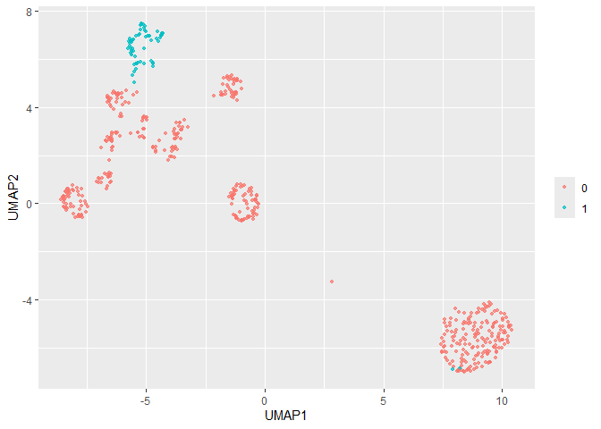<!-- -->
# Изменим n_neighbors и min_dist

Вывод: появилось 2 голубых кластера, данные выглядят более однородными


``` r
umap_prep <- recipe(~., data = num_data) %>% 
  step_normalize(all_predictors()) %>% 
  step_umap(all_predictors(),neighbors=5, min_dist=0.5) %>%  # по умолчанию было 15 и 0.01 соответственно
  prep() %>%   
  juice() 

umap_prep %>%
  ggplot(aes(UMAP1, UMAP2)) + 
  geom_point(aes(color = as.character(num_data$dead)),
             alpha = 0.7, size = 1) +
  labs(color = NULL)
```

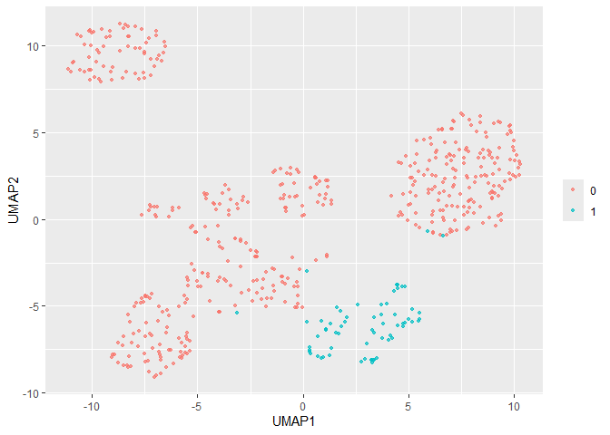<!-- -->


